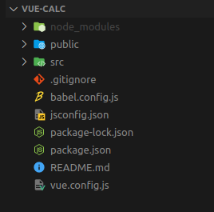
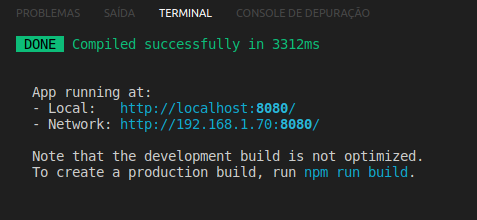
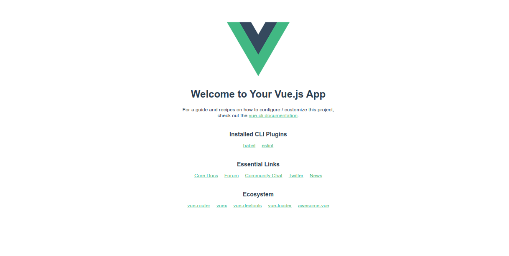
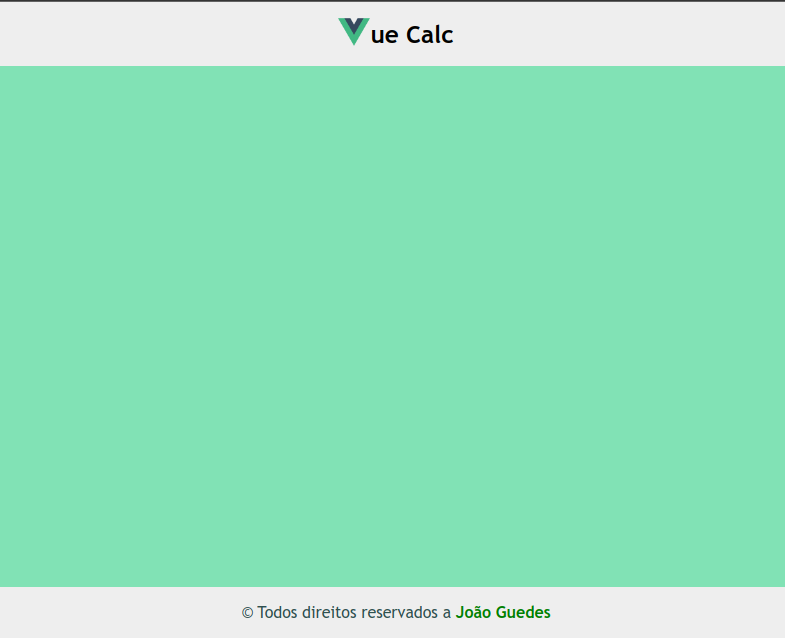
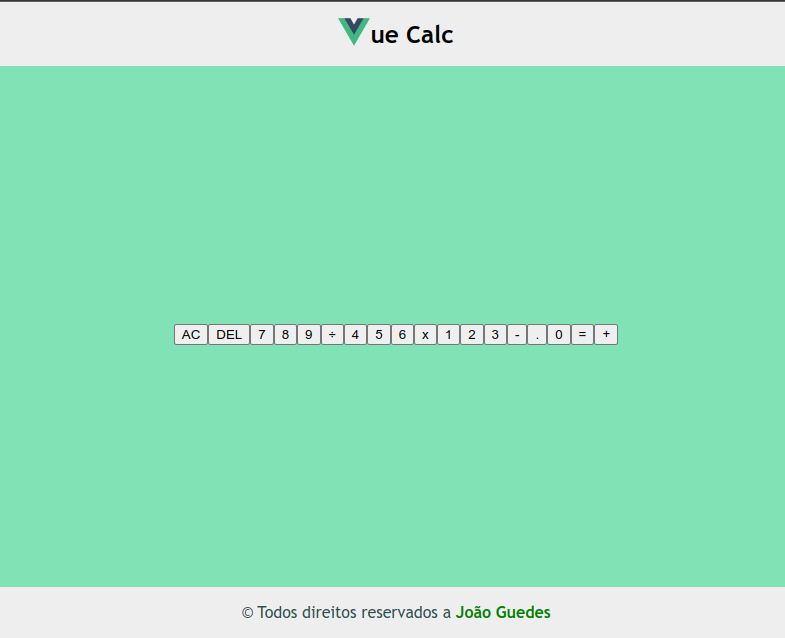
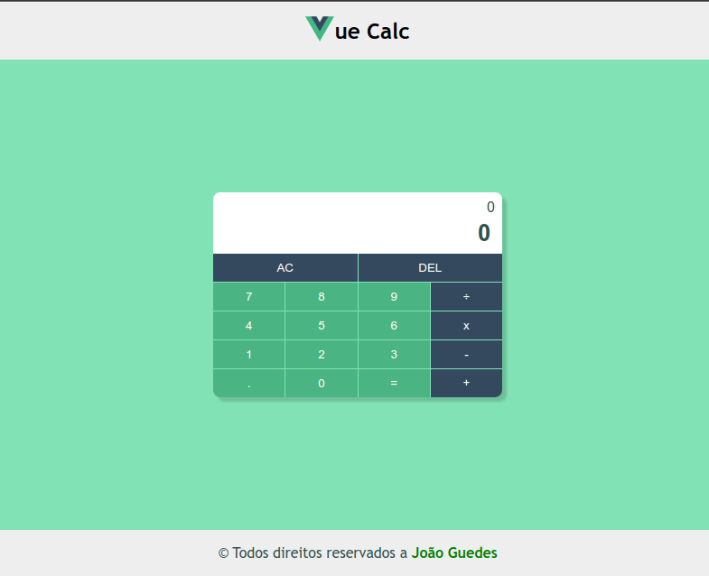

# Calculadora em Vue JS

## Requisitos

- [NodeJS](https://nodejs.org/en/)
- [Visual Studio Code](https://code.visualstudio.com/)

## Avisos importantes

>O foco deste tutorial não é no design nem no estilo, então a estruturas css e html seram apresentadas superficalmente e não haverá uma discursão detalhada quando a sua implentação, o foco desse tutorial estará voltado a estrutura do Vue bem como seu comportamente e funcionamento, bem como suas funções implentadas com o javascript.

# Passo a passo

## Criar o projeto 

Depois do Node JS devidamente instalado, primeiro vamos criar um projeto VueJS. Para isso use o seguinte comando:

```sh
vue create vue-calc
```

Dê um enter na primeira opção que aparecer no terminal e aguarde a instalação o `vue-calc` é o nome do projeto e pode ser definindo segundo sua vontade porém com algumas restrições. Seguindo as orientações mostradas no terminal após copncluir a instalação vamos acessar a pasta do projeto com o comando `cd` e depois abrir o projeto no VSCode usando o comando `code .`:

```sh
cd vue-calc
code .
```

Após abrir o projeto no vscode deve se depara com a seguinte estrutura:



Para iniciar nosso projeto vamos abrir o terminal no vscode, para tanto poderá ir em terminal &gt; novo terminal, ou usar o atalho de teclas Ctrl + shift + `. Um vez aberto digite o comando npm run serve e clique no enter, assim que carregar ele mostrará a seguinte mensagem no seu terminal e provavelmente abrir uma nova aba em seu navegador:



Caso não tenha aberto a aba no navegado basta copiar o link Local ou Network e colar na url do navegador para abrir a página:



## Preparando a base

Agora vamos fazer algumas alterações para prepara a base, primiero vamos deletar o arquivo HelloWord.vue que está no diretório components. e depois vamos limpar as referências desse componentes do arquivo App.vue ficando semelhante ao seguinte código:

```html
<template>

</template>

<script>
export default {
  name: 'App',
  components: {
  }
}
</script>
```

# Criando componentes

## MenuBase.vue

Agora dentro da pasta `components` crie um arquivo chamado `MenuBase.vue`, e crie a seguinte estrutura apenas para teste:

```html
<template>
    <nav>
        <div class="logo">
            
        </div>
        <div class="title">
            <h3>ue Calc</h3>
        </div>
    </nav>
</template>
<script>
export default {
  
}
</script>

<style>
nav {
    font-family: 'Gill Sans', 'Gill Sans MT', Calibri, 'Trebuchet MS', sans-serif;
    display: flex;
    align-items: center;
    justify-content: center;
    background-color: #eee;
    height: 10vh;
}
nav .logo img {
    width: 2rem;
}

nav .title {
    font-size: 1.3rem;
    text-align: center;
}
</style>
```

## FooterBase.vue

No mesmo diretório também crie o `FooterBase.vue` com o seguinte código:

```html
<template>
    <footer>
        <p>&copy; Todos direitos reservados a <span>João Guedes</span></p>
    </footer>
</template>
<script>
export default {
  
}
</script>

<style>
footer {
    font-family: 'Gill Sans', 'Gill Sans MT', Calibri, 'Trebuchet MS', sans-serif;
    bottom: 0;
    position: fixed;
    text-align: center;
    width: 100%;
    background-color: #eee;
    height: 8vh;
}
p {
    color: darkslategray;
}

p span {
    color: green;
    font-weight: bold;
}
</style>
```

## CalcBase.vue

Por fim crie o corpo do seu projeto que serpa o `CalcBase.vue`, que a princípio conterá o seguinte codigo:

```html
<template>
  <main>
    
  </main>
</template>

<script>
export default {
  
}
</script>

<style>
main {
  font-family:'Franklin Gothic Medium', 'Arial Narrow', Arial, sans-serif;
  background-color: #81e2b5;
  height: 82vh;
  display: flex;
  align-items: center;
  justify-content: center;
}
</style>
```

Agora para que sua aplicação possa usar os componentes criados, será necessário importa-los no App.vue e chama-los no template, para importalos primiero vamos adicionar o seguinte código aos nossos scripts:

```html
<script>
import CalcBase from './components/CalcBase.vue';
import MenuBase from './components/MenuBase.vue';
import FooterBase from './components/FooterBase.vue';

export default {
  name: 'App',
  components: {
    CalcBase,
    MenuBase,
    FooterBase
  }
}
</script>
```

E depois chama-los em nosso template:

```html
<template>
  <MenuBase />
  <CalcBase />
  <FooterBase />
</template>
```

Se tudo deu certo deve se deparar com essa página:



# Criando calculadora

Para criar a base html da nossa calculadora vamos adicionar o seguinte código ao nosso arquivo CalcBase.vue entre as tags &lt;main&gt;&lt;/main&gt;

```html
<div class="calculator">
  <div class="screen">
    <p class="history">0</p>
    <p class="value">0</p>
  </div>

  <div class="group-button">
    <button class="btn ac">AC</button>
    <button class="btn del">DEL</button>
    <button class="btn">7</button>
    <button class="btn">8</button>
    <button class="btn">9</button>
    <button class="btn operation">÷</button>
    <button class="btn">4</button>
    <button class="btn">5</button>
    <button class="btn">6</button>
    <button class="btn operation">x</button>
    <button class="btn">1</button>
    <button class="btn">2</button>
    <button class="btn">3</button>
    <button class="btn operation">-</button>
    <button class="btn p">.</button>
    <button class="btn">0</button>
    <button class="btn">=</button>
    <button class="btn operation pluss">+</button>
  </div>
</div>
```

O que nos mostrará algo semelhante a isso:


Para estilizar esse componente e ele se parecer de fato com uma calculadora vamos adicionar o seguinte código css após o código do main entre as tags &lt;style&gt;&lt;/style&gt;:

```css
.calculator {
  width: 20rem;
  border-radius: .5rem;
  box-shadow: rgba(0, 0, 0, 0.15) .3rem .3rem 2.6px;
}

.calculator .screen {
  border-radius: .5rem .5rem 0 0;
  text-align: right;
  display: block;
  background-color: white;
  widows: 100%;
  height: 35%;
  padding: .5rem;
}

.calculator .screen p {
  margin: 0;
  padding: .6rem .3;
}
.calculator .screen .history {
  margin-bottom: .3rem;

}
.calculator .screen .value {
  font-size: 1.6rem;
  font-weight: bold;
  margin-right: .3rem;
}

.group-button {
  display: grid;
  grid-template-columns: repeat(4, 1fr);
  grid-template-rows: repeat(5, 1fr);
  grid-gap: 1px;
}

.group-button .btn {
  border: none;
  padding: .5rem .7rem;
  cursor: pointer;
  background-color: #4bb483;
  color: #fff;
}

.group-button .btn:hover {
    background-color: #448a69;
}

.pluss {
  border-radius: 0 0 .5rem 0;
}

.p {
  border-radius: 0 0 0 .5rem;
}

.group-button .ac {
  grid-area: 1 / 1 / 2 / 3;
}

.group-button .del {
  grid-area: 1 / 3 / 2 / 5;
}


.group-button .ac,
.group-button .del,
.group-button .operation {
  background-color: #35495e;
}

.group-button .equal:hover,
.group-button .operation:hover {
  background-color: #2b3947;
}
```

E agora teremos a seguinte página:



Agora dentro do nosso data no nosso script javascript vamos adicionar as seguintes variaveis:

```javascript
export default {
  data () {
    return {
      getOperation: '0',
      getResult: 0,
    }
  }
}
```

Também vamos adiciona-los a nossa inteface html para mais adiante fazermos integrações dinâmicas na interface e com o vue essas interações são apresentadas instataneamente sem a necessidade de recarregar a página:

```html
<div class="screen">
  <p class="history">{{ getOperation }}</p>
  <p class="value">{{ getResult }}</p>
</div>
```

Agora vamos criar nossos métodos:

## Método ac()

```javascript
methods: {
  ac() {
    this.getResult = '0';
    this.getOperation = '0';
  }
}
```

Esse método será responsável por receber os valores digitados e fazer a transição para a screen de operações após mostrar o resultado.

## Método del()

```javascript
del() {
  if (this.getResult != '0') {
    this.getResult = this.getResult.substring(0, this.getResult.length - 1);
    if (this.getResult.length < 1) {
      this.getResult = '0';
    }
  }
}
```

Verifica se o valor atual da nossa variável getResult é diferente de zero, se for o caso ele vai verificar se a quantidade de caraceteres é maior que 1, sendo maior ele vai remover o ultimo caractere digitado e caso o a quantidade seja igual a um, porém diferente de zero ele ira retornar o valor a zero.

## Método click()

```javascript
click(a) {
  if (this.getResult == '0') {
    this.getResult=a;
  } else {
    this.getResult += a;
  }
},
```

Vai capturar o valor digitado e adicionar a nossa variável getResult que mostrará na tela a operação que está sendo formulada.

## Método result()

```javascript
result() {
  let operation = this.getResult;
  this.getOperation = operation;

  operation = operation.replace('x', '*');
  operation = operation.replace('÷', '/');
  this.getResult = eval(operation);
}
```

Por fina esse método irá armazenar o valor do getResult em uma variável, a qual também é passada ao getOperation para que o mesmo mostre a ultima operação realizada, depois fará a trativa para subistituir as operações de x e ÷ pelos operadores interpretáveis pelo javascript ara efetuar a mesma operação e ao final adicionará a variavel getResult a função eval() que irá calcular o vamor armazenado na variável operation.

Por fim, altere o código html para chamar os métodos usando o @click do vue:

```html
<div class="group-button">
  <button class="btn ac" @click="ac()">AC</button>
  <button class="btn del" @click="del('del')">DEL</button>
  <button class="btn" @click="click('7')">7</button>
  <button class="btn" @click="click('8')">8</button>
  <button class="btn" @click="click('9')">9</button>
  <button class="btn operation" @click="click('÷')">÷</button>
  <button class="btn" @click="click('4')">4</button>
  <button class="btn" @click="click('5')">5</button>
  <button class="btn" @click="click('6')">6</button>
  <button class="btn operation" @click="click('x')">x</button>
  <button class="btn" @click="click('1')">1</button>
  <button class="btn" @click="click('2')">2</button>
  <button class="btn" @click="click('3')">3</button>
  <button class="btn operation" @click="click('-')">-</button>
  <button class="btn p" @click="click('.')">.</button>
  <button class="btn" @click="click('0')">0</button>
  <button class="btn" @click="result()">=</button>
  <button class="btn operation pluss" @click="click('+')">+</button>
</div>
```

Ao final deve ter o seguinte código no seu arquivo CalcBase.vue:

```html
<template>
  <main>
    <div class="calculator">
      <div class="screen">
        <p class="history">{{ getOperation }}</p>
        <p class="value">{{ getResult }}</p>
      </div>
      <div class="group-button">
        <button class="btn ac" @click="ac()">AC</button>
        <button class="btn del" @click="del('del')">DEL</button>
        <button class="btn" @click="click('7')">7</button>
        <button class="btn" @click="click('8')">8</button>
        <button class="btn" @click="click('9')">9</button>
        <button class="btn operation" @click="click('÷')">÷</button>
        <button class="btn" @click="click('4')">4</button>
        <button class="btn" @click="click('5')">5</button>
        <button class="btn" @click="click('6')">6</button>
        <button class="btn operation" @click="click('x')">x</button>
        <button class="btn" @click="click('1')">1</button>
        <button class="btn" @click="click('2')">2</button>
        <button class="btn" @click="click('3')">3</button>
        <button class="btn operation" @click="click('-')">-</button>
        <button class="btn p" @click="click('.')">.</button>
        <button class="btn" @click="click('0')">0</button>
        <button class="btn" @click="result()">=</button>
        <button class="btn operation pluss" @click="click('+')">+</button>
      </div>
    </div>
  </main>
</template>

<script>
export default {
  data () {
    return {
      getOperation: '0',
      getResult: 0,
    }
  },

  methods: {
    ac() {
      this.getResult = '0';
      this.getOperation = '0';
    },
    del() {
      if (this.getResult != '0') {
        this.getResult = this.getResult.substring(0, this.getResult.length - 1);
        if (this.getResult.length < 1) {
          this.getResult = '0';
        }
      }
    },
    click(a) {
      if (this.getResult == '0') {
        this.getResult=a;
      } else {
        this.getResult += a;
      }
    },
    result() {
      let operation = this.getResult;
      this.getOperation = operation;

      operation = operation.replace('x', '*');
      operation = operation.replace('÷', '/');
      this.getResult = eval(operation);
    }
  }
}
</script>

<style>
main {
  font-family:'Franklin Gothic Medium', 'Arial Narrow', Arial, sans-serif;
  background-color: #81e2b5;
  height: 82vh;
  display: flex;
  align-items: center;
  justify-content: center;
}

.calculator {
  width: 20rem;
  border-radius: .5rem;
  box-shadow: rgba(0, 0, 0, 0.15) .3rem .3rem 2.6px;
}

.calculator .screen {
  border-radius: .5rem .5rem 0 0;
  text-align: right;
  display: block;
  background-color: white;
  widows: 100%;
  height: 35%;
  padding: .5rem;
}

.calculator .screen p {
  margin: 0;
  padding: .6rem .3;
}
.calculator .screen .history {
  margin-bottom: .3rem;

}
.calculator .screen .value {
  font-size: 1.6rem;
  font-weight: bold;
  margin-right: .3rem;
}

.group-button {
  display: grid;
  grid-template-columns: repeat(4, 1fr);
  grid-template-rows: repeat(5, 1fr);
  grid-gap: 1px;
}

.group-button .btn {
  border: none;
  padding: .5rem .7rem;
  cursor: pointer;
  background-color: #4bb483;
  color: #fff;
}

.pluss {
  border-radius: 0 0 .5rem 0;
}

.p {
  border-radius: 0 0 0 .5rem;
}

.group-button .btn:hover {
    background-color: #448a69;
}

.group-button .ac {
  grid-area: 1 / 1 / 2 / 3;
}

.group-button .del {
  grid-area: 1 / 3 / 2 / 5;
}


.group-button .ac,
.group-button .del,
.group-button .operation {
  background-color: #35495e;
}

.group-button .equal:hover,
.group-button .operation:hover {
  background-color: #2b3947;
}
</style>
```

Agora só testar sua aplicação!

